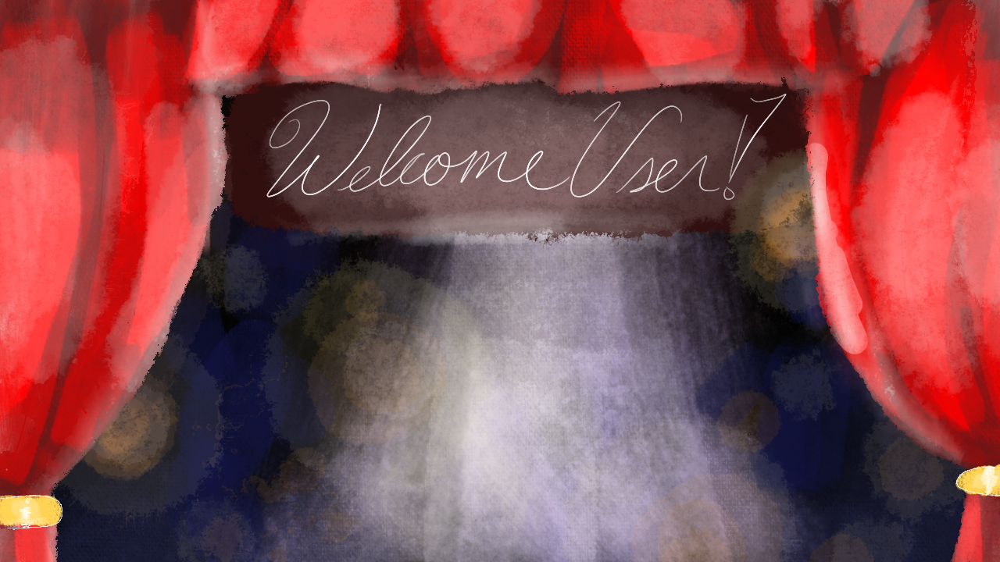
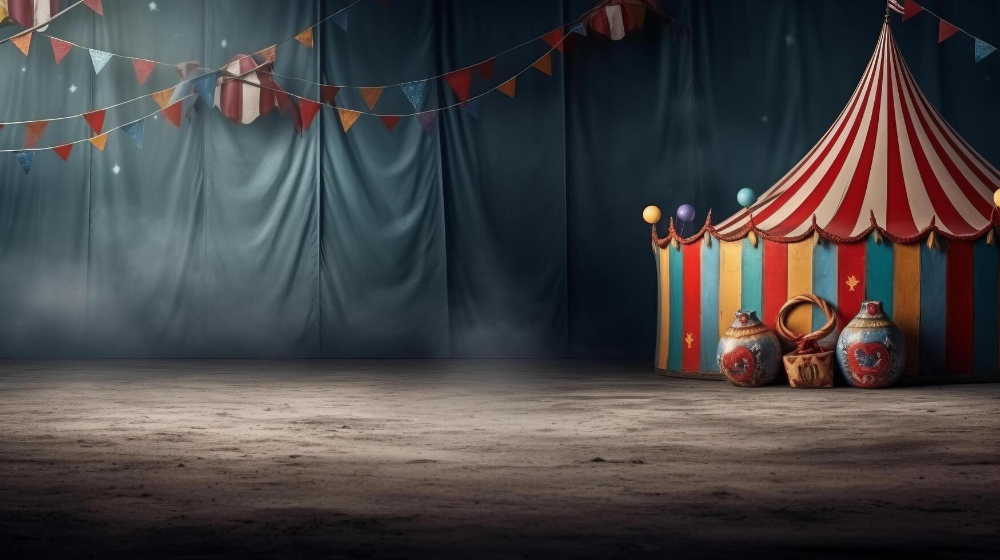
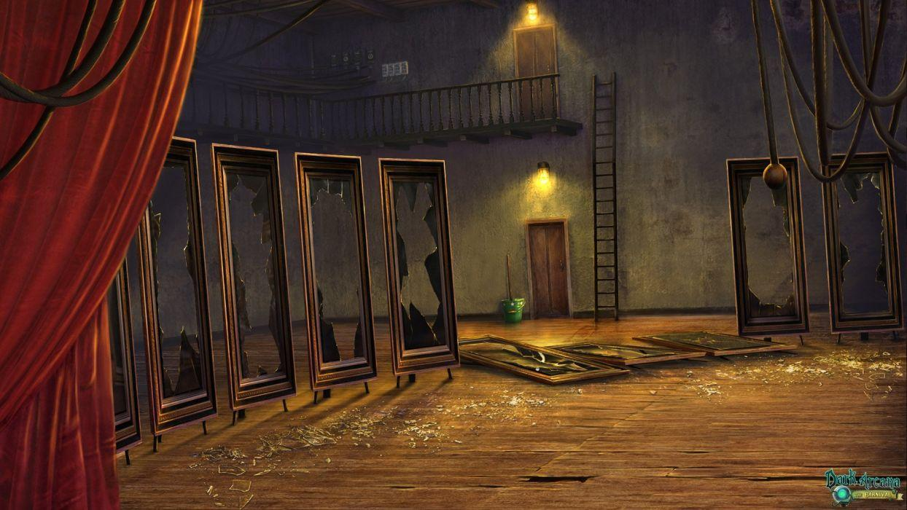
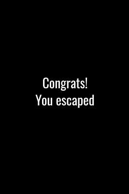

# Clown-Circus
A browser-based mini app that is a puzzle game inlcuding the theme of the circus.

## Features 
- Instructional Guidance
- Instructional Popups
- Drag and Drop
- Responsive Screen Changing
- Guessing the Rabbit Placement
- Randomized Key Placements

## How to Play
- Read the instructions per level
- Complete each task
- Once you place the key to the last door you escape
- May reset game repeatedly

## Code Overview
This code contains the important following functions: 

### 1. Play Function with Fade

```javaScript
playBtn.addEventListener("click", () => {
    updateInstruction("Find the bunny in the three hats!"); //INSTRUCTION TAB
    showInstruction();  //SHOW TAB HERE

    fadeOverlay.style.opacity = 1;
    //fADEOVERLAY SET
    setTimeout(() => {
        homepage.classList.remove("visible");
        levelOne.classList.add("visible");
        fadeOverlay.style.opacity = 0;
    }, 600);
    });
```

### 2. level One Function - Randomized Boxes and fade to next Level

```javascript
let correctBox = Math.floor(Math.random() * 3);

    boxes.forEach(box => {
    box.addEventListener("click", () => {
        const clicked = parseInt(box.dataset.id);

        if (clicked === correctBox) {
        fadeOverlay.style.opacity = 1;

        setTimeout(() => {
            updateInstruction("Find the Key and put it in your pocket!");
            showInstruction();   // ← SHOW TAB HERE

            levelOne.classList.remove("visible");
            levelThree.classList.add("visible");
            fadeOverlay.style.opacity = 0;

            document.getElementById("boxesContainer").style.display = "none";

            setupLevelThree();
        }, 600);

        } else {
        wrongPopup.classList.remove("hidden");
        }
    });
    });
```

### 3. Level Two Function - Random Key Assortment Drag and Drop -- Next Level Fade

```javascript
function setupLevelThree() {
    const keyBoxes = document.querySelectorAll('.keyBox');
    const dropZone = document.getElementById('drop-zone');
    let draggedKey = null;

    const randomIndex = Math.floor(Math.random() * keyBoxes.length);

    keyBoxes.forEach((box, index) => {
        box.innerHTML = "";

        if (index === randomIndex) {
        const key = document.createElement('img');
        key.src = 'key.webp';
        key.classList.add('key');
        key.setAttribute('draggable', 'true');

        key.addEventListener('dragstart', (e) => {
            draggedKey = key;
            e.dataTransfer.setData('text/plain', 'key');
            key.style.opacity = '0.5';
        });

        key.addEventListener('dragend', () => {
            key.style.opacity = '1';
        });

        box.appendChild(key);
        }
    });

    dropZone.addEventListener('dragover', (e) => {
        e.preventDefault();
        dropZone.classList.add('drag-over');
    });

    dropZone.addEventListener('dragleave', () => {
        dropZone.classList.remove('drag-over');
    });

    dropZone.addEventListener('drop', (e) => {
        e.preventDefault();
        dropZone.classList.remove('drag-over');

        if (draggedKey) {
        dropZone.innerHTML = "";
        dropZone.appendChild(draggedKey);


        draggedKey.style.width = "80px";
        draggedKey.style.opacity = "1";

        draggedKey = null;

        setTimeout(() => {
            fadeOverlay.style.opacity = 1;

            setTimeout(() => {
            levelThree.classList.remove("visible");
            levelFour.classList.add("visible");

            showInstruction();   // ← SHOW TAB HERE

            setupLevelFour();

            fadeOverlay.style.opacity = 0;
            }, 600);
        }, 400);
        }
    });
    }
```

### 4. Instructional Functions
```javascript
function updateInstruction(text) {
    const tab = document.getElementById("instructionTab");
    tab.textContent = text;
    }

    function showInstruction() {
    document.getElementById("instructionTab").style.display = "block";
    }

    function hideInstruction() {
    document.getElementById("instructionTab").style.display = "none";
    }
```

### 5. Reset Button Function
```javascript

    resetBtn.addEventListener("click", () => {
    fadeOverlay.style.opacity = 1; // fade to black

    setTimeout(() => {
        // Hide all levels
        levelOne.classList.remove("visible");
        levelThree.classList.remove("visible");
        levelFour.classList.remove("visible");
        levelFive.classList.remove("visible");

        // Show homepage
        homepage.classList.add("visible");

        // Reset instructions
        hideInstruction();

        // Reset Level One randomness
        correctBox = Math.floor(Math.random() * 3);

        // Reset Level Three
        document.getElementById("boxesContainer").style.display = "flex";
        document.getElementById("drop-zone").innerHTML = "";
        document.querySelectorAll(".keyBox").forEach(box => box.innerHTML = "");

        // Reset Level Four key (simple safe reset)
        const level4Key = document.getElementById("level4Key");
        const level4Area = document.getElementById("sideKeyBox"); // your original container
        if (level4Area && level4Key) {
        level4Area.appendChild(level4Key);
        level4Key.style.width = "90px";
        }

        // Fade back in
        setTimeout(() => {
        fadeOverlay.style.opacity = 0;
        }, 200);

    }, 600);
    });
```

## Technologies Used
- JavaScript
- HTML
- CSS

## Implementation
To Implement in this code: 

1. HTML Menu File with:
- A menu screen with:
  - Play Button
  - Instructions PopUp
- A game screens with:
  1. Level One
     - Guess the Rabbit location
  2. Level Two
     - Drag and Drop
  3. Level Three
     - Drag and Drop Part Two
  4. Ending Page
     - Reset Button
2. The JavaScript provided above
3. Optional CSS for styling

### Example of HTMl Structure
```html
  <!DOCTYPE html>
    <html lang="en">
    <head>
        <meta charset="UTF-8">
        <meta name="viewport" content="width=device-width, initial-scale=1.0">
        <title>Circus Clowns</title>
        <script src="script.js" defer></script>
        <link rel="stylesheet" href="style.css">
    </head>
    <body>
        <!-- Homepage -->
        <div id="homepage" class="screen visible">
            

            <button id="playBtn" class="menu-btn">Play</button>
            <button id="instructionsBtn" class="menu-btn">Instructions</button>
        </div>

        <!-- Level One -->
        <div id="levelOne" class="screen">
            
            <div id="boxesContainer">
                <div class="box" data-id="0">
                    
                </div>
                <div class="box" data-id="1">
                    
                </div>
                <div class="box" data-id="2">
                    
                </div>
            </div>
        </div>
        <div id="wrongPopup" class="wrong-popup hidden">
            <div class="wrong-popup-content">
                <p>No Bunny in Here!</p>
                <button class="wrong-close" id="wrongCloseBtn">Close</button>
            </div>
        </div>

<!--Levelthree- -skipped over two -->
       <div id="levelThree" class="screen">
        
        <div class="thirdlevel">
            <div id="keyBoxesContainer">
                <div class="keyBox bottom-left"></div>
                <div class="keyBox bottom-right"></div>
            </div>
        </div>
            <div id="drop-zone">Drop Key Here</div>
        </div>

<!--Leavel four-->
        <div id="levelFour" class="screen">
            
            <div id="sideKeyBox" class="side-box">
                
            </div>
            <div id="bigDropZone" class="big-drop-zone"></div>
        </div>

<!--ending level-->
        <div id="levelFive" class=" level5-bg screen">
            
            <button id="resetBtn" class="reset-button">Reset Game</button>
        </div>


        <!-- Instructions Popup -->
        <div id="instructionsPopup" class="popup hidden">
            <div class="popup-content">
            <h2 style="text-decoration: underline;"><strong>Instructions</strong></h2>
            <p>1. Enter the Circus</p>
            <p>2. Solve Each Puzzle</p>
            <p>3. Find the Key</p>
            <p>4. Escape the Game!</p>
            <button id="closePopup">Close</button>
            </div>
        </div>

        <!--Instructions Tab-->
        <div id="instructionTab" class="textTab"></div>

        <!-- Fade overlay -->
        <div id="fadeOverlay"></div>

    </body>
    </html>
```
### Known Issues/Improvements: 
